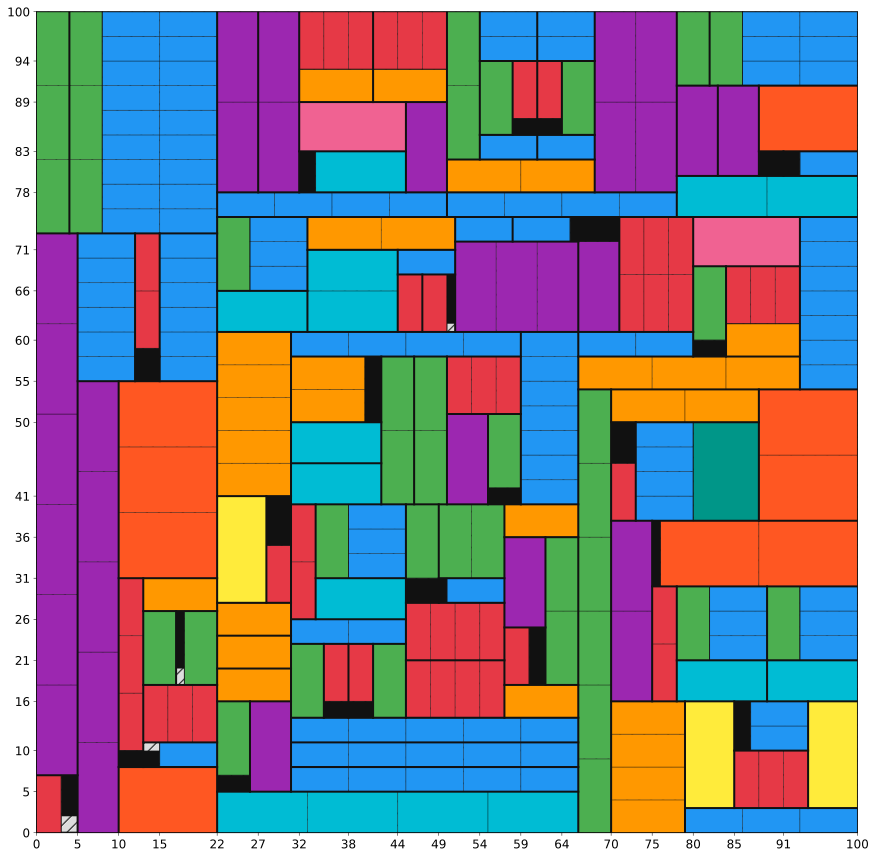

# Guillotine Cutter
[](https://github.com/NicolaPerin/guillotine-cutter/actions/workflows/ci.yml)
[](https://codecov.io/gh/NicolaPerin/guillotine-cutter)

## Features
- Exact dynamic programming algorithm for 2D guillotine cutting with defects
- C extension with OpenMP parallelization for fast solving
- Handles defects and irregular regions
- JSON and CSV input support
- Command-line interface with `benchmark`, `solve`, and `plot` subcommands
- Inline problem definition via `--sheet`, `--items`, and `--defects` flags
- `--dry-run` flag to preview problem stats and memory estimates before solving

## Installation

**Development version (from source):**
```bash
git clone https://github.com/NicolaPerin/guillotine-cutter.git
cd guillotine-cutter
pip install -e .[dev]
python setup.py build_ext --inplace
```

The second command installs the package and its dependencies. The third compiles
the C extension (`_solver.so`) which is required for solving — without it the
solver falls back to a slower pure Python implementation.

## Quick Start

### Python API
```python
from guillotine.core.geometry import SheetGeometry
from guillotine.core.patterns import CutPatternGenerator
from guillotine.core.dp_solver import GuillotineDP

# Define problem
item_sizes = [[5, 10, 12], [5, 10, 12]]
defect_sizes = [[2], [2]]
defect_positions = [[9], [9]]
sheet_size = (27, 27)

# Solve
geom = SheetGeometry(sheet_size, defect_sizes, defect_positions)
patterns = CutPatternGenerator(item_sizes, geom)
dp = GuillotineDP(item_sizes, geom, patterns)
value, sequence = dp.solve()
print(f"Optimal value: {value}")
```

### CLI Usage

The CLI uses three subcommands: `benchmark`, `solve`, and `plot`.

```bash
# Run the built-in 27x27 benchmark
guillotine benchmark

# Run benchmark with visualization and profiling
guillotine benchmark --plot --profile

# Preview problem stats and memory estimate without solving
guillotine solve problem.json --dry-run

# Solve from a JSON file
guillotine solve problem.json

# Solve inline (sheet + items + optional defects)
guillotine solve --sheet 27x27 --items 5x5 10x10 12x12 --defects 9,9,2x2

# Save output to a custom file with a plot
guillotine solve problem.json -o my_solution.json --plot result.png

# Plot from a previously saved solution (no re-solving needed)
guillotine plot output/solution.json

# With profiling
guillotine solve --sheet 27x27 --items 5x5 10x10 --profile
```

All outputs (JSON, PNG, SVG, profile) are saved to `./output/` by default unless a path with a directory is specified.

#### Subcommand reference

| Flag | `benchmark` | `solve` | `plot` | Description |
|---|---|---|---|---|
| `--plot [FILE]` | ✓ | ✓ | | Save visualization (default: `plot.png`) |
| `--profile [FILE]` | ✓ | ✓ | | Save profiling data (default: `profiling.txt`) |
| `-o / --output FILE` | ✓ | ✓ | ✓ | Output file (default: `solution.json` or `plot.png`) |
| `--dry-run` | ✓ | ✓ | | Print problem summary and memory estimate, then exit |
| `--sheet WxH` | | ✓ | | Sheet dimensions for inline mode |
| `--items WxH ...` | | ✓ | | Item sizes for inline mode |
| `--defects X,Y,WxH ...` | | ✓ | | Defect positions/sizes for inline mode |

The `plot` subcommand takes a single solution JSON file (which embeds the
problem definition) and generates a visualization without re-solving.

### Input Formats

**JSON format** (`problem.json`):
```json
{
  "problem": {
    "sheet_size": [27, 27],
    "items": [
      {"id": 0, "width": 5, "height": 5},
      {"id": 1, "width": 10, "height": 10}
    ],
    "defects": [
      {"x": 9, "y": 9, "width": 2, "height": 2}
    ]
  }
}
```

**CSV format** (loadable via Python API):
```
# items.csv
width,height
5,5
10,10

# defects.csv
x,y,width,height
9,9,2,2
```

## Output

The solver generates:
- **JSON solution** with metrics (utilization, efficiency, cut sequence) and
  the embedded problem definition, saved to `./output/`
- **PNG + SVG visualization** (optional) showing the cutting pattern
- **Profile data** (optional) for performance analysis

## Performance

The hot loop of the DP is implemented as a C extension (`_solver.c`) compiled
with `-O2 -funroll-loops`. The `(x,y)` positions at each fixed `(w,h)` slice
are parallelized with OpenMP using `schedule(dynamic, 16)`. The number of
threads defaults to the system default (typically all available cores) and can
be controlled via the `OMP_NUM_THREADS` environment variable:

```bash
OMP_NUM_THREADS=6 guillotine solve problem.json
```

Benchmark results on a Ryzen 5 9600X (6 cores, OMP_NUM_THREADS=6):

| Sheet   | Items | Defects | Time   | Memory |
|---------|-------|---------|--------|--------|
| 27×27   | 4     | 1       | 0.002s | 30 MB  |
| 40×40   | 4     | 6       | 0.013s | 37 MB  |
| 60×60   | 4     | 10      | 0.058s | 79 MB  |
| 80×80   | 6     | 15      | 0.238s | 190 MB |
| 100×100 | 10    | 20      | 0.703s | 422 MB |

Example output for a 100x100 sheet with 10 item types and 20 defects (in black):



### Memory model

The algorithm stores three categories of data:

- **g and F tables** (2D, always allocated): `g_values`, `g_indices`,
  `F_values`, `F_type`, `F_param` — shape `(W+1) × (H+1)` each. These are
  small (a few KB to a few hundred KB).

- **Prefix sum** (2D): `prefix` — shape `(W+1) × (H+1)`, used for O(1)
  defect overlap queries. Also small.

- **Fd table** (4D, dominates memory): `Fd_values` — shape
  `(W+1) × (H+1) × (W+1) × (H+1)` in `int32`. This is where nearly all
  memory goes. Only allocated when the sheet contains defects.

Previously, three 4D arrays were stored (`Fd_values`, `Fd_type`, `Fd_param`,
each `int32`), totaling 12 bytes per cell. The current implementation stores
only `Fd_values` (4 bytes per cell) — a **3× reduction**. Decision types and
parameters are no longer stored; instead, they are re-derived during solution
reconstruction by checking which candidate cut reproduces the optimal value.

The `--dry-run` flag shows the estimated memory breakdown before solving:

```
$ guillotine solve examples/problem_100x100.json --dry-run
============================================================
DRY RUN — Problem Summary
============================================================

  Sheet size:    100 x 100  (area: 10,000)

  Item types:    10
    [0]  5 x 5  (area: 25)
    ...

  Defects:       20
    [0]  at (12, 45)  size 8 x 6  (area: 48)
    ...
  Total defect area: 1,234  (12.3% of sheet)

  Estimated memory usage:
    g tables (values + indices):      79.2 KB
    F tables (values + type + param): 89.2 KB
    Prefix sum array:                 39.6 KB
    Fd dense 4D array:                397.0 MB  (104,060,401 cells)
    ----------------------------------------
    Total estimated:                  397.2 MB

============================================================
```

The estimated and actual memory usage for square sheets:

| Sheet     | Fd cells      | Estimated total | Actual RSS |
|-----------|---------------|-----------------|------------|
| 27 × 27  | 614,656       | 2.4 MB          | 30 MB      |
| 40 × 40  | 2,825,761     | 10.8 MB         | 37 MB      |
| 60 × 60  | 13,845,841    | 52.9 MB         | 79 MB      |
| 80 × 80  | 42,998,721    | 164.3 MB        | 190 MB     |
| 100 × 100| 104,060,401   | 397.2 MB        | 422 MB     |

The ~25 MB gap between estimated and actual is the constant overhead of
Python, numpy, and the C extension runtime. For large sheets the Fd table
dominates and the overhead becomes negligible.

Memory grows as `O((W+1)² × (H+1)²)` — roughly the fourth power of sheet
size for square sheets. The full table is allocated upfront regardless of how
many states are actually needed. Memory is therefore the binding constraint
for large problems.

## Development

```bash
# Install in development mode
pip install -e .[dev]

# Compile C extension
python setup.py build_ext --inplace

# Run all tests
pytest tests/ -v

# Run tests with coverage
pytest tests/ --cov=guillotine --cov-report=term
```

## Architecture

```
guillotine-cutter/
├── src/guillotine/
│   ├── core/
│   │   ├── geometry.py      # SheetGeometry: defect prefix sums, O(1) purity queries
│   │   ├── patterns.py      # CutPatternGenerator: normal pattern cut positions
│   │   ├── dp_solver.py     # GuillotineDP: DP solver, reconstruction
│   │   ├── _solver.c        # C extension: fill_g, fill_F, fill_Fd with OpenMP
│   │   └── constants.py     # DECISION_* constants shared by Python and C
│   ├── io.py                # JSON/CSV I/O, input validation
│   ├── visualize.py         # Matplotlib visualization
│   └── __main__.py          # CLI entry point
├── setup.py                 # C extension build configuration
├── tests/                   # Test suite
└── examples/                # Example problem JSON files
```

### Algorithm overview

The solver implements exact guillotine DP in three phases:

**Phase 1 — g-table (`fill_g`):** For each rectangle size `(w,h)`, compute the
best value achievable by tiling with copies of a single item type. Implemented
in C with OpenMP parallelization across widths.

**Phase 2 — F-table (`fill_F`):** For each rectangle size `(w,h)`, compute the
optimal value assuming no defects (pure rectangle). Tries single-item tiling
from Phase 1, vertical cuts, and horizontal cuts at normal pattern positions.
Uses symmetry (only tries cuts up to half the dimension). Implemented in C,
sequential (bottom-up dependency).

**Phase 3 — Fd-table (`fill_Fd`):** For each rectangle size `(w,h)` and
position `(x,y)`, compute the optimal value accounting for defects. Pure
positions (detected via O(1) prefix-sum query) reuse Phase 2 results directly.
Defected positions try all normal pattern cuts and defect-aligned cuts, taking
the best. Implemented in C with OpenMP parallelization across `(x,y)` positions
at each fixed `(w,h)`.

## Citation

This project is inspired by the guillotine cutting approach for 2D cutting stock problems with defects described in:

H. Zhang, S. Yao, Q. Liu, J. Leng, and L. Wei,
"Exact approaches for the unconstrained two-dimensional cutting problem with defects,"
*Computers & Operations Research*, vol. 160, 106407, 2023.
[https://doi.org/10.1016/j.cor.2023.106407](https://doi.org/10.1016/j.cor.2023.106407)

## License

MIT License - see [LICENSE](LICENSE) file for details.