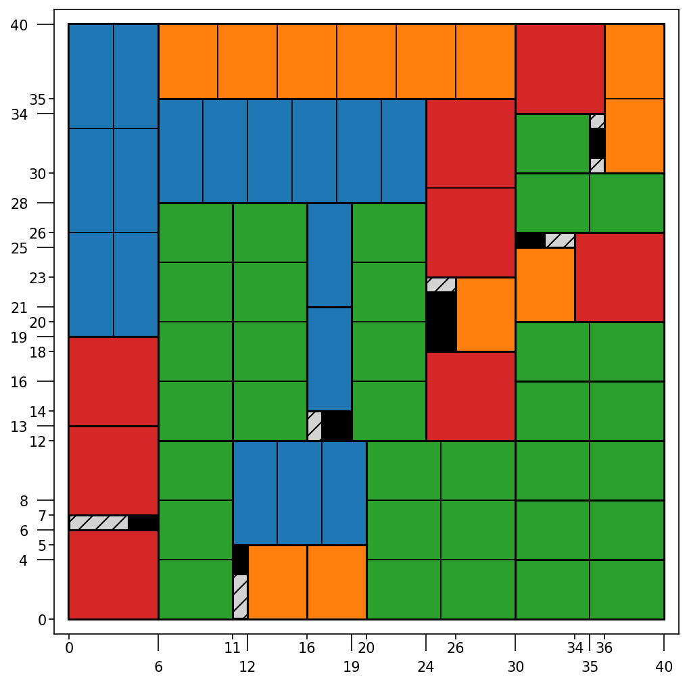

# Guillotine Cutter
[](https://github.com/NicolaPerin/guillotine-cutter/actions/workflows/ci.yml)
[](https://codecov.io/gh/NicolaPerin/guillotine-cutter)

## Features
- Exact dynamic programming algorithm for 2D guillotine cutting with defects
- C extension with OpenMP parallelization for fast solving
- Handles defects and irregular regions
- JSON and CSV input support
- Command-line interface with `benchmark` and `solve` subcommands
- Inline problem definition via `--sheet`, `--items`, and `--defects` flags

## Installation

**Development version (from source):**
```bash
git clone https://github.com/NicolaPerin/guillotine-cutter.git
cd guillotine-cutter
pip install -e .[dev]
python setup.py build_ext --inplace
```

The second command installs the package and its dependencies. The third compiles
the C extension (`_solver.so`) which is required for solving — without it the
solver falls back to a slower pure Python implementation.

## Quick Start

### Python API
```python
from guillotine.core.geometry import SheetGeometry
from guillotine.core.patterns import CutPatternGenerator
from guillotine.core.dp_solver import GuillotineDP

# Define problem
item_sizes = [[5, 10, 12], [5, 10, 12]]
defect_sizes = [[2], [2]]
defect_positions = [[9], [9]]
sheet_size = (27, 27)

# Solve
geom = SheetGeometry(sheet_size, defect_sizes, defect_positions)
patterns = CutPatternGenerator(item_sizes, geom)
dp = GuillotineDP(item_sizes, geom, patterns)
value, sequence = dp.solve()
print(f"Optimal value: {value}")
```

### CLI Usage

The CLI uses two subcommands: `benchmark` and `solve`.

```bash
# Run the built-in 27x27 benchmark
guillotine benchmark

# Run benchmark with visualization and profiling
guillotine benchmark --plot --profile

# Solve from a JSON file
guillotine solve problem.json

# Solve inline (sheet + items + optional defects)
guillotine solve --sheet 27x27 --items 5x5 10x10 12x12 --defects 9,9,2x2

# Save output to a custom file with a plot
guillotine solve problem.json -o my_solution.json --plot result.png

# With profiling
guillotine solve --sheet 27x27 --items 5x5 10x10 --profile
```

All outputs (JSON, PNG, profile) are saved to `./output/` by default unless a path with a directory is specified.

#### Subcommand reference

| Flag | `benchmark` | `solve` | Description |
|---|---|---|---|
| `--plot [FILE]` | ✓ | ✓ | Save visualization (default: `plot.png`) |
| `--profile [FILE]` | ✓ | ✓ | Save profiling data (default: `profiling.txt`) |
| `-o / --output FILE` | ✓ | ✓ | Output JSON file (default: `solution.json`) |
| `--sheet WxH` | | ✓ | Sheet dimensions for inline mode |
| `--items WxH ...` | | ✓ | Item sizes for inline mode |
| `--defects X,Y,WxH ...` | | ✓ | Defect positions/sizes for inline mode |

### Input Formats

**JSON format** (`problem.json`):
```json
{
  "problem": {
    "sheet_size": [27, 27],
    "items": [
      {"id": 0, "width": 5, "height": 5},
      {"id": 1, "width": 10, "height": 10}
    ],
    "defects": [
      {"x": 9, "y": 9, "width": 2, "height": 2}
    ]
  }
}
```

**CSV format** (loadable via Python API):
```
# items.csv
width,height
5,5
10,10

# defects.csv
x,y,width,height
9,9,2,2
```

## Output

The solver generates:
- **JSON solution** with metrics (utilization, efficiency, cut sequence) saved to `./output/`
- **PNG visualization** (optional) showing the cutting pattern
- **Profile data** (optional) for performance analysis

## Performance

The hot loop of the DP is implemented as a C extension (`_solver.c`) compiled
with `-O2 -funroll-loops`. The `(x,y)` positions at each fixed `(w,h)` slice
are parallelized with OpenMP using `schedule(dynamic, 16)`. The number of
threads defaults to the system default (typically all available cores) and can
be controlled via the `OMP_NUM_THREADS` environment variable:

```bash
OMP_NUM_THREADS=6 guillotine solve problem.json
```

Benchmark results on a Ryzen 5 9600X (6 cores, OMP_NUM_THREADS=6):

| Sheet   | Items | Defects | Time   | Memory |
|---------|-------|---------|--------|--------|
| 27×27  | 4     | 1       | 0.003s | 34 MB  |
| 40×40   | 4     | 6       | 0.013s | 58 MB  |
| 60×60   | 4     | 10      | 0.058s | 182 MB |
| 80×80   | 6     | 15      | 0.238s | 514 MB |
| 100×100 | 10    | 20      | 0.703s | 1.2 GB |

Example output for the 40×40 problem (4 item types, 6 defects):



### Memory requirements

The algorithm stores three 4D arrays of shape `(W+1, H+1, W+1, H+1)` in
`int32`, giving a memory footprint of approximately `3 × (N+1)^4 × 4` bytes for
an `N×N` sheet. This grows as the fourth power of sheet size:

| Sheet   | Memory |
|---------|--------|
| 60×60   | 182 MB |
| 80×80   | 514 MB |
| 100×100 | 1.2 GB |
| 120×120 | 2.6 GB |
| 150×150 | 7.9 GB |

The full table is allocated upfront regardless of how many states are actually needed. 
In the current implementation, memory is therefore the binding constraint for large problems.

## Development

```bash
# Install in development mode
pip install -e .[dev]

# Compile C extension
python setup.py build_ext --inplace

# Run all tests
pytest tests/ -v

# Run tests with coverage
pytest tests/ --cov=guillotine --cov-report=term
```

## Architecture

```
guillotine-cutter/
├── src/guillotine/
│   ├── core/
│   │   ├── geometry.py      # SheetGeometry: defect prefix sums, O(1) purity queries
│   │   ├── patterns.py      # CutPatternGenerator: normal pattern cut positions
│   │   ├── dp_solver.py     # GuillotineDP: DP solver, reconstruction
│   │   ├── _solver.c        # C extension: fill_Fd hot loop with OpenMP
│   │   └── constants.py     # DECISION_* constants shared by Python and C
│   ├── io.py                # JSON/CSV I/O, input validation
│   ├── visualize.py         # Matplotlib visualization
│   └── __main__.py          # CLI entry point
├── setup.py                 # C extension build configuration
├── tests/                   # Test suite
└── examples/                # Example problem JSON files
```

### Algorithm overview

The solver implements exact guillotine DP in two phases:

**Phase 1 — pure rectangles (`_precompute_F`):** For each rectangle size
`(w,h)`, compute the best tiling assuming no defects. This is a standard 2D
knapsack DP and only requires a `(W+1)×(H+1)` table.

**Phase 2 — defected rectangles (`_fill_Fd`):** For each rectangle size `(w,h)`
and position `(x,y)`, compute the best tiling accounting for defects. Pure
rectangles reuse Phase 1 results directly. Defected rectangles try all normal
pattern cuts and all defect boundary cuts, taking the best. This requires a
`(W+1)×(H+1)×(W+1)×(H+1)` table indexed as `[w,h,x,y]` for cache locality.

The hot loop of Phase 2 is implemented in `_solver.c` and parallelized with
OpenMP across `(x,y)` positions at each fixed `(w,h)`.

## Citation

This project is inspired by the guillotine cutting approach for 2D cutting stock problems with defects described in:

H. Zhang, S. Yao, Q. Liu, J. Leng, and L. Wei,
"Exact approaches for the unconstrained two-dimensional cutting problem with defects,"
*Computers & Operations Research*, vol. 160, 106407, 2023.
[https://doi.org/10.1016/j.cor.2023.106407](https://doi.org/10.1016/j.cor.2023.106407)

## License

MIT License - see [LICENSE](LICENSE) file for details.